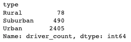

# PyBer_Analysis
Mod 05 Python analysis of (fake) data of PyBer (Uber-clone)

## Overview of Analysis
The following is an analysis of rideshare data for PyBer. The data was accumulated from January through June, 2019, of all rideshare data in the region. PyBer works in several cities, categorized by Urban, Suburban, and Rural areas. This analysis shows the differences in ride-share among these different city types, including total rides, total drivers, average fare per ride, average fare per rider, and the total fare by city type. This information provides actionable information regarding PyBer's various areas of operation.

### Resources
Data Source: city_data.csv, ride_data.csv   
Software: PythonData Dev Environment (Python 3.7.11), Jupter Notebook 6.4.6  
Dependencies: matplotlib.pyplot, pandas, style from matplotlib  

## Results
The following analysis will be provided below:  
* total rides,  
* total drivers,  
* total fares by city type,  
* average fare per ride,  
* average fare per rider.  

### Total Rides and Total Drivers
Unsurprisingly, there are significantly more total rides and drivers for PyBer in our Urban cities than in the Rural cities. Suburban city rides and drivers make up approximately five times the number of Rural rides and drivers, and approximately 40% of Urban rides and 20% of Urban drivers. See the totals listed below of total rides and drivers.  

### Total Fares
The total fares collected by city type again show that PyBer is doing far more business in Urban areas than is done in Suburban and Rural areas. Urban cities in the first half of 2019 resulted in almost $40,000 in collected fares in Urban cities, while Suburban cities made approximately 50% of that total ($20,000), and Rural cities made approximately 12% of the Urban total ($4,300).  

### Average Fares Per Ride and Per Driver
The average fare per ride and driver are heavily weighted towards Rural cities. That is, Rural cities show the highest average fare per ride ($34.62) and per driver ($55.49). Urban averages are noticeably lower, with an average of $24.53 per ride and $16.57 per driver. Suburban average fares are firmly in between these other two data points, per ride ($30.97), and per driver ($39.50)

A summary chart can be seen below showing all of the details discussed above.  

### Per Week Line Chart
The following line chart shows the collected fares by city type by week from January 1, 2019, through April 28, 2019. The total fares collected in Urban cities is consistently the highest among the three city types. Rural cities are consistently the lowest overall, whereas Suburban cities are fairly consistently collecting approximately 40% of the fares of Urban cities. Notably, there was a significant upturn in fares at the end of February in all three city types. We should determine if there was an outside factor driving this temporary change in the data, such as a regional event or change in the weather that could account for the increased fares during this week.   

## Summary
PyBer is doing not yet doing robust business in this region. For a company currently valued at $2.3B, the fares are meager. The total fares for the first half of 2019 amount to approximately $65,000. Three suggestions follow regarding how PyBer can improve our metrics in this region.  

1. Emphasize Urban ridesharing. While the average fare per ride and per driver is the lowest of the three regions, the total fares collected account for approximately 60% of the generated fares. Urban ridesharing makes up in volume what it lacks in per ride fares.  
2. In the next analysis, fares collected should be compared to distance traveled and/or should be compared to the profit generated, not merely the fare collected. This might provide further insight into the relative value of rides especially in Suburban and Rural areas.  
3. Further analysis of fares collected by week is warranted. Are there external factors that are not currently noted in our dataset that could account for movements up or down in the total amount of fares collected? While it was noted above that late February marked a time of increased fare collection for all three city types, the total fares collected by city type did not move in lock-step. Tracking total fares against weather or events may provide some significant insight into trends for fare movement, especially where there are differences between the city types in the region.  

